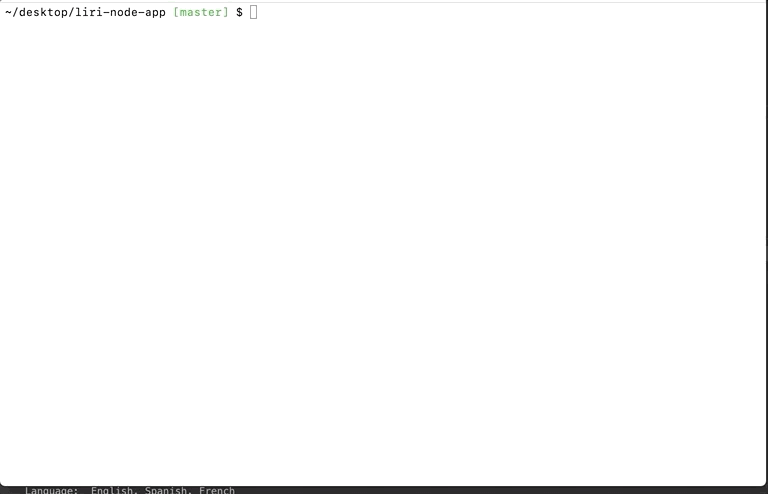

# liri-node-app

This is my submission for assignment number 8: LIRI Bot. We were tasked with creating language iterpretation and recognition interface: aka LIRI. LIRI is a command line node app that takes in parameters and gives you back data from several APIs including OMDb, BandsInTown, and Spotify. In order to accomplish this, I had to utilize my understanding of Node.js as well as various node packages including: node-spotify-api, axious, moment, as well as the OMDB and BandsInTown APIs. 

Directions: In order to successfully run LIRI, the user must first open the terminal where the JavaScript file is initially located. When the terminal appears, the user must first input two things: Node & liri.js. Once these are written, the user may select between four separate options: 

1) spotify-this-song & "user song choice" : this will access the Spotify API and will display a number of different categories related to the user's song of choice.

2) concert-this & "user's preferred artist" : this will access the BandsInTown API and will display the next concert in which the user's preffered artist is playing.

3) movie-this & "user's preferred moive" : this will access the OMDb API and will display a number of different categories relating to the user's movie of choice.

4) do-what-it-says : when the user types this, it will locate text within the random.txt file and display the results from what is logged inside. currently, it will bring up Spotify results for the song "I Hate Your Best Friend" by Fritz Montana (quite arguably the greatest band in the world).

Tech I Used:

[Node.js](https://www.w3schools.com/nodejs/)

[Spotify API](https://developer.spotify.com/documentation/)

[BandsInTown API](https://manager.bandsintown.com/support/bandsintown-api)

[JavaScript](https://www.w3schools.com/js/)

[OMDb API](http://www.omdbapi.com/)

[Moment.js](https://momentjs.com/)

[Axios](https://github.com/axios/axios)

Author: [Matthew Hagarty](https://github.com/matthewryanhagarty)